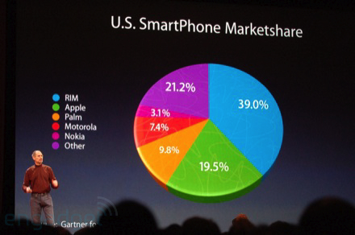
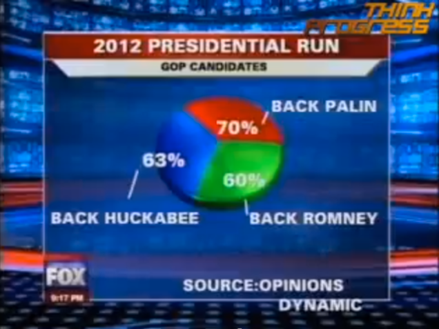
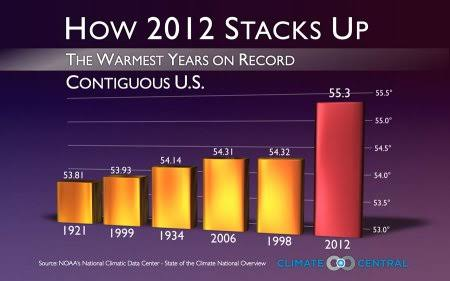

# Cours DataViz ( Les Visualisations Trompeuses )

## Visualisation 1 — Jouer avec les perspectives 

Cette visualisation est **trompeuse** car l’effet de perspective du graphique en camembert déforme visuellement les proportions : le segment vert représentant Apple (19,5 %) paraît beaucoup plus grand que le segment violet « Other » (21,2 %), alors qu’il devrait être légèrement plus petit. Pour la corriger, il faudrait **supprimer la perspective et utiliser un camembert en 2D**, ou mieux encore, un **diagramme en barres** permettant de comparer directement les pourcentages.

## Visualisation 2 — Des pourcentages qui dépassent 100 %

Cette visualisation est **trompeuse** car elle utilise un graphique en tarte alors que les pourcentages affichés (63 %, 70 % et 60 %) totalisent **193 %**, ce qui contredit la convention d’un camembert dont la somme doit représenter 100 %. De plus, l’effet de perspective fait paraître le segment de Romney (60 %) plus grand que celui de Palin (70 %), ce qui fausse encore davantage la comparaison ; pour la corriger, il faudrait **indiquer clairement que plusieurs réponses étaient possibles et utiliser un diagramme en barres** plutôt qu’un camembert.

## Visualisation 3 — Une échelle qui déforme les différences

Cette visualisation est **trompeuse** car l’axe vertical est fortement tronqué : il commence autour de 53 °F au lieu de partir de zéro, ce qui fait paraître les différences entre les années beaucoup plus importantes qu’elles ne le sont réellement. De plus, l’utilisation d’une **couleur différente et plus visible pour 2012** attire l’attention sur cette barre et accentue visuellement son importance ; pour la corriger, il faudrait utiliser une **échelle cohérente et clairement indiquée**, idéalement en partant de zéro, et conserver la même couleur pour toutes les années.
